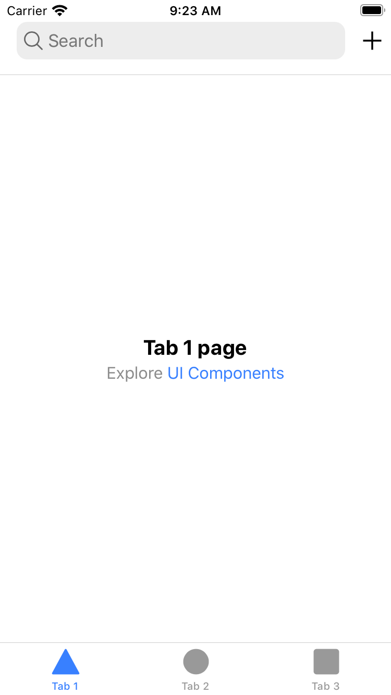

# Search Bar in Ion Header iOS Styling Quirk

When placing an `ion-searchbar` inside an `ion-toolbar` inside an `ion-header`, there is a `padding-bottom` set to `15px`.

This creates a sub-optimal experience wherein the `ion-searchbar` is not properly aligned to other items inside the `ion-toolbar`.

## Reproduction

This app reproduces the design quirk, and can be viewed by doing the following:

1. `npm i`
2. `npm run build`
3. `npx cap open ios`

## Resulting UI

